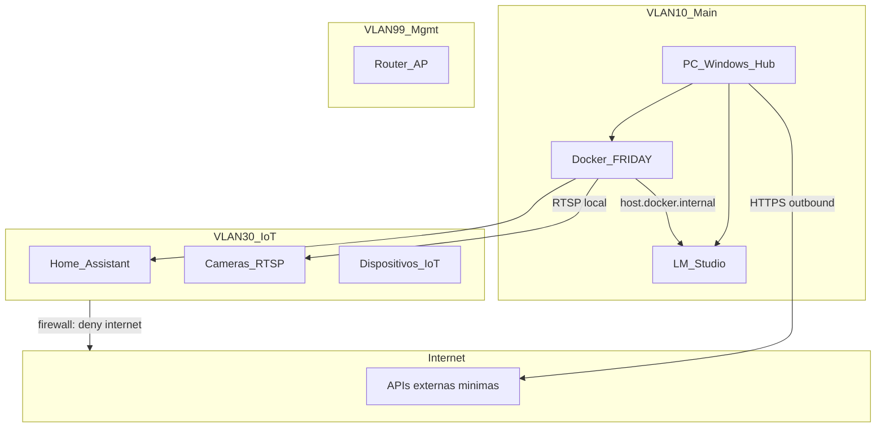

# Arquitectura Self-Hosted — F.R.I.D.A.Y-AI

Visão geral da arquitectura local-first para o assistente pessoal modular (Fases 0–8).

## Princípios

| Princípio | Decisão |
|---|---|
| Orçamento inicial | **0€** — PC Windows existente como hub (`192.168.10.131`) |
| GPU | NVIDIA dedicada — LLM, Whisper, Frigate com aceleração |
| Privacidade | Local-first; cloud só onde inevitável |
| Arranque | PC liga → pergunta se iniciar FRIDAY → só então sobe serviços pesados |
| Câmaras | Vídeo 100% local (Frigate + RTSP); zero egress para cloud |
| Serviços externos | Apenas tier gratuito ou custo mínimo para uso pessoal |

## Diagrama lógico

## Fases do projecto

| Fase | Módulo | Stack principal | Carga no PC |
|---|---|---|---|
| 0 | Fundações | Docker, LM Studio, healthcheck | Baixa |
| 1 | Núcleo conversacional (voz) | Whisper, Piper TTS, orquestrador | Alta (GPU) |
| 2 | Produtividade | CalDAV, IMAP | Baixa |
| 3 | Casa inteligente + câmaras | Home Assistant, Frigate, MQTT | **Alta** |
| 4 | Saúde (wearables) | Import/sync local | Baixa |
| 5 | Finanças | Open Banking read-only | Baixa |
| 6 | Passwords | Vaultwarden | Baixa |
| 7 | Assistência de código | LLM coder local | Média (GPU) |

## Hub actual (0€)

O **PC Windows** actua como hub único:

- **Docker Desktop** — orquestração de serviços ([`docker-compose.yml`](../../docker-compose.yml))
- **LM Studio** — inferência LLM local (API OpenAI-compatible)
- **GPU NVIDIA** — aceleração para LLM, Whisper e Frigate

Serviços pesados só arrancam após confirmação no login ([`scripts/friday-start.ps1`](../../scripts/friday-start.ps1)).

## Política anti-sobrecarga

| Serviço | Quando corre | GPU |
|---|---|---|
| LM Studio | Após confirmação no login | Sim |
| Whisper STT | Durante conversa por voz | Sim |
| Frigate NVR | Após confirmação ou horário definido | Sim |
| Home Assistant | Opcional always-on (leve) | Não |
| Vaultwarden | Always-on (leve) ou Mini-PC futuro | Não |

## Rede

Três VLANs recomendadas antes da Fase 3 — ver [rede-vlan.md](rede-vlan.md).

| VLAN | ID | Subnet | Dispositivos |
|---|---|---|---|
| Main | 10 | `192.168.10.0/24` | PC hub, telemóveis, portáteis |
| IoT | 30 | `192.168.30.0/24` | Câmaras, sensores, smart plugs |
| Mgmt | 99 | `192.168.99.0/24` | Router, APs, switch |

## Software por bloco de instalação

### Bloco A — Fundação (Fase 0)

| # | Software | Comando |
|---|---|---|
| 1 | Git | `winget install Git.Git` |
| 2 | Docker Desktop | `winget install Docker.DockerDesktop` |
| 3 | WSL2 | `wsl --install` + reiniciar |
| 4 | LM Studio | [lmstudio.ai](https://lmstudio.ai) |
| 5 | Repo | `git clone https://github.com/TiagoPedrotkd/F.R.I.D.A.Y-AI.git` |
| 6 | Compose | `copy .env.example .env` → `docker compose up -d --build` |

### Bloco B — Arranque condicional

| # | Componente | Ficheiro |
|---|---|---|
| 7 | Script arranque | [`scripts/friday-start.ps1`](../../scripts/friday-start.ps1) |
| 8 | Task Scheduler | [`scripts/register-startup-task.ps1`](../../scripts/register-startup-task.ps1) |

### Bloco C — Fase 1 (Voz)

| # | Software | Instalação |
|---|---|---|
| 9 | CUDA Toolkit | `winget install Nvidia.CUDA` |
| 10 | Whisper | Container Docker (faster-whisper) |
| 11 | Piper TTS | Container ou binário local |
| 12 | Python 3.12 | `winget install Python.Python.3.12` |

### Bloco D — Fase 2 (Produtividade)

| # | Software | Instalação |
|---|---|---|
| 13 | Radicale / Baikal | Container CalDAV local |
| 14 | Email IMAP | Python `imaplib` — directo, sem middleware cloud |

### Bloco E — Fase 3 (Casa inteligente)

| # | Software | Instalação |
|---|---|---|
| 15 | Home Assistant | Container Docker |
| 16 | Frigate NVR | Container + NVIDIA runtime; gravações locais |
| 17 | Mosquitto MQTT | Container — broker local |

### Bloco F — Fases 4–7

| # | Software | Instalação |
|---|---|---|
| 18 | Vaultwarden | Container — password manager self-hosted |
| 19 | GoCardless (Open Banking) | API gratuita pessoal — read-only |
| 20 | Grafana + Prometheus | Monitorização (opcional) |

## Single Points of Failure

| SPOF | Impacto | Mitigação |
|---|---|---|
| PC único desligado | Tudo offline | Mini-PC N100 dedicado (futuro) |
| Disco falha | Perda configs/gravações | Backups `restic` → USB encriptado |
| Router falha | Sem rede | UPS + export config router |
| LM Studio GUI | LLM cai se app fechar | Migrar para Ollama/llama.cpp headless (Fase 1+) |
| GPU VRAM limitada | LLM + Frigate + Whisper competem | Modelos quantizados; Coral USB para Frigate |
| Docker Desktop | RAM extra | Docker Engine nativo em WSL2 ou Linux no Mini-PC |
| Secrets num `.env` | Perda = reconfigurar | Vaultwarden + backup encriptado |

## Ligação Hub ↔ Internet

- **Outbound:** calendar, email IMAP, Open Banking, actualizações
- **Inbound:** nenhum — acesso remoto via **Tailscale** (gratuito pessoal) se necessário
- **Câmaras:** RTSP local → Frigate → disco local; **zero egress de vídeo**

## Documentos relacionados

| Documento | Conteúdo |
|---|---|
| [rede-vlan.md](rede-vlan.md) | Configuração VLANs e firewall |
| [../fase-0/decisoes-hardware.md](../fase-0/decisoes-hardware.md) | Hardware actual e roadmap de compras |
| [../fase-0/gestao-secrets.md](../fase-0/gestao-secrets.md) | Política de secrets |
| [../../scripts/README.md](../../scripts/README.md) | Scripts de arranque |
